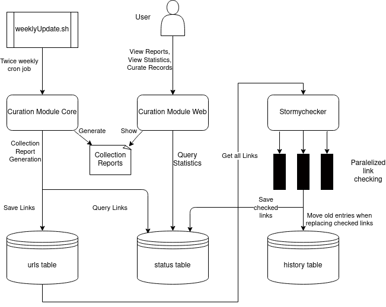

# Clarin Curation Module

Curation Module is a service developed and offered by the technical team of the ACDH-CH on behalf of CLARIN-ERIC. Its goal is to support CMD metadata authors and curators to improve quality of metadata for language resources. 

# Structure and functionality

Curation Module consists of three modules:

1. Core Module
2. Web Module
3. Link Checker Module

### Architecture

### Curation Module Core
This module does the actual analysis of individual CMD profiles, records and whole collections according to a number of quality criteria and generates reports and statistics which help discover potential problems that cause a lower metadata quality.

The reports are re-generated regularly (twice weekly) on the most recent dump of CMDI records as collected by the [CLARIN-VLO harvester](https://vlo.clarin.eu/oai-harvest-viewer/). 

### Curation Module Web
This is the user facing web application. It offers four main functions:

1. Presenting pre-computed statistics for [CMDI profiles](https://curate.acdh.oeaw.ac.at/profile/table)
2. Presenting pre-computed statistics for [collections](https://curate.acdh.oeaw.ac.at/collection/table)
3. On the fly [validation of individual profiles and metadata records](https://curate.acdh.oeaw.ac.at/) (either by their URLs or uploading them as files)
4. Continuously generated statistics of the [link checking](https://curate.acdh.oeaw.ac.at/statistics)

### Link Checker Module (Stormychecker)
It checks constantly and repeatedly (with respecting the robots.txt files) all the URLs 
contained in metadata records of the collections. Checking means sending HEAD and/or 
GET requests to URLs and saving the results (just the request meta-information, 
the headers, not the payload itself) in a database. Core module later uses these 
results to generate statistics and takes them into consideration when assessing 
the quality of the metadata. Additionally, the results are also used by the 
[CLARIN metadata catalogue, the VLO](https://vlo.clarin.eu/), to indicate the availability of a resource.

This module is maintained in a [separate code-base](https://github.com/acdh-oeaw/stormychecker).

### FAQ and Feedback
You can go to our [faq](https://curate.acdh.oeaw.ac.at/faq) page, which tries to answer the most common questions. If your question is not answered, feel free to create an issue on our github page, reachable via [feedback](https://github.com/clarin-eric/clarin-curation-module/issues).

### Build and Deployment
The web application is built as a Docker image and pushed to the Clarin Docker registry via the [docker-curation-module](https://gitlab.com/CLARIN-ERIC/docker-curation-module) project.
This image is then deployed together with the Stormychecker on the Clarin server via [compose_curation_module_stormychecker](https://gitlab.com/CLARIN-ERIC/compose_curation_module_stormychecker) project.

#### Git Branches
* master = production on minerva
* development = staging on hephaistos
* clarinDeploy = future production (currently testing) on clarin server 

